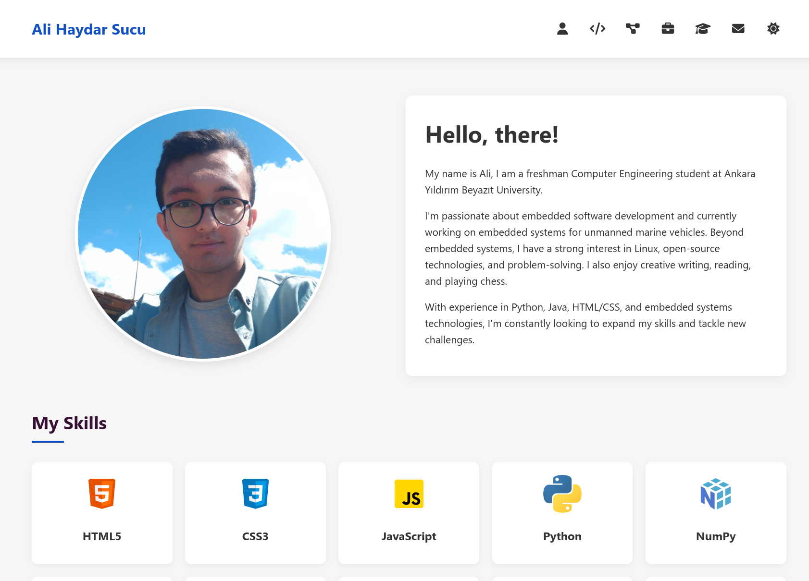
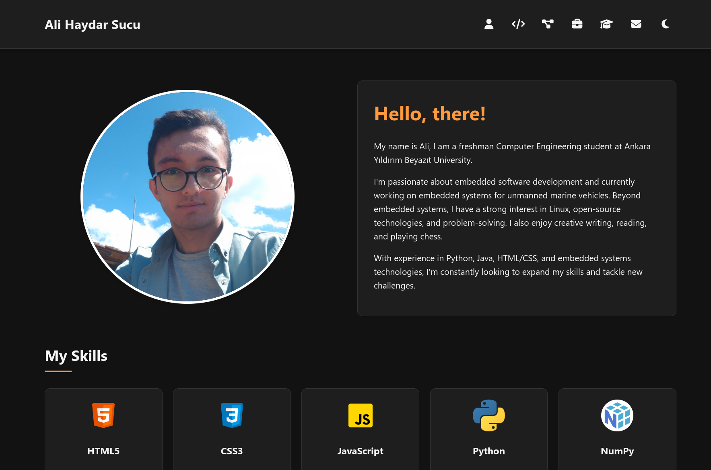

# 🌐 My Portfolio Website

Welcome to my personal portfolio website! This site showcases my background, skills, projects, experience, education, and certifications.

🌟 **Check it out here**: [Portfolio](https://github.com/alihaydarsucu/alihaydarsucu.github.io)

## 📌 Key Features

- **Responsive Design**: Optimized for all screen sizes and devices.
- **Dark/Light Mode**: Seamlessly toggle between themes with preferences saved.
- **Interactive Navigation**: Smooth scrolling and a mobile-friendly hamburger menu.
- **Detailed Sections**:
  - About Me
  - Skills
  - Projects
  - Experience
  - Education
  - Volunteering
  - Licenses & Certifications
  - Contact

## 🚀 Technologies Used

- **Frontend**: HTML5, CSS3, JavaScript
- **Version Control**: Git & GitHub

## 📷 Previews

### **Light Mode:**

### **Dark Mode:**

## 📜 License

This project is open-source and available under the [MIT License](LICENSE).

⭐ If you like this project, consider giving it a **star** on GitHub!
