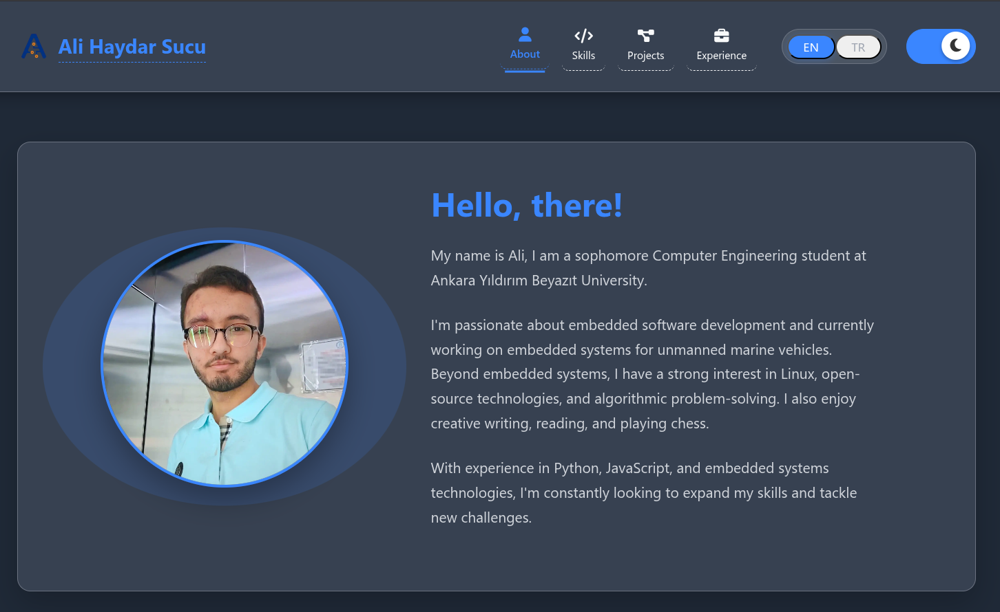
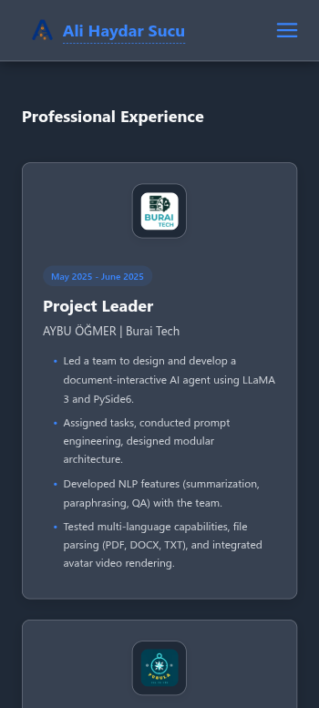
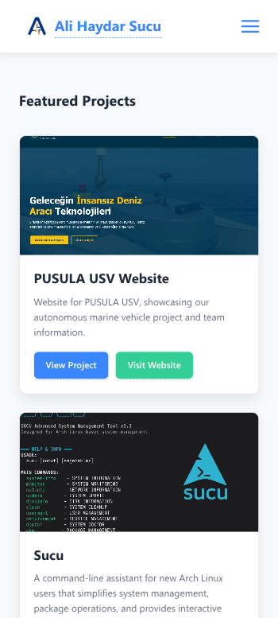
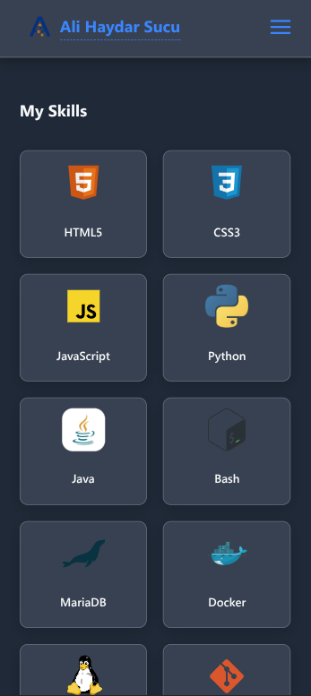

<div align="center" style="background: #17A2B8; padding: 2rem; border-radius: 10px; color: white; margin-bottom: 2rem; box-shadow: 0 4px 6px rgba(0,0,0,0.1);">
  
  <h1 style="color: white; margin: 0.5rem 0; font-size: 2.5rem;">Ali Haydar Sucu</h1>
  <p style="font-size: 1.2rem; opacity: 0.9; margin: 0;">Computer Engineering Student</p>
</div>

## 🌟 <span style="color: #3A86FF;">About This Project</span>

This repository contains my personal portfolio website and an automated CV generation system. The website serves as a professional showcase of my skills, projects, and experience, while the CV system ensures my resume is always up-to-date and ATS-optimized.

## 🚀 <span style="color:#2667CC;">Key Features</span>

### <span style="color: #3A86FF;">Website</span>

The website consists of 4 main pages, all fully responsive and available in both English and Turkish:

1. **Home** (`index.html`) - Introduction and quick overview
2. **Experience** (`experience.html`) - Professional journey and education
3. **Skills** (`skills.html`) - Technical skills and competencies
4. **Projects** (`projects.html`) - Portfolio of selected works

Key Features:

- **Fully Responsive** - Optimized for all device sizes
- **Dark/Light Mode** - Automatic system preference detection
- **Bilingual Support** - Seamless English/Turkish toggle
- **Dynamic Content** - Projects automatically pulled from GitHub
- **Modern UI/UX** - Clean, accessible, and performant design

### <span style="color: #3A86FF;">📄 Automated CV Generation</span>

- **Oxford-style LaTeX CV** - Academic and professional appearance
- **ATS-optimized Format** - Passes through applicant tracking systems
- **Automatic Updates** - New CV on every commit
- **Two-page Support** - No length restrictions
- **Professional Typography** - Powered by LaTeX

## <span style="color: #3A86FF;">✨ Visual Showcase</span>

<div align="center">
  <h3>Desktop View on Dark Mode</h3>
  
  <p>Homepage on Desktop</p>
  
  <h3>Mobile Views</h3>
  <div style="display: flex; justify-content: center; gap: 40px; flex-wrap: wrap; background: #6B7280; padding: 1.5rem; border-radius: 10px; margin: 1rem 0; box-shadow: 0 2px 4px rgba(0,0,0,0.05);">
    <div>
      
      <p><strong>Experience (Dark Mode) Page</strong></p>
      </div>
      <div>
        
        <p><strong>Projects (Light Mode) Page</strong></p>
      </div>
      <div>
        
        <p><strong>Skills (Dark Mode) Page</strong></p>
    </div>
  </div>
</div>

## 🛠️ <span style="color: #3A86FF;">Technology Stack</span>

### Frontend

- **Core**: HTML5, CSS3, JavaScript (ES6+)
- **Icons**: Font Awesome 6
- **Styling**: Custom CSS with Flexbox/Grid
- **Performance**: Lazy loading, image optimization
- **Accessibility**: ARIA labels, semantic HTML

### CV Generation System

- **Engine**: LuaLaTeX
- **Template**: Custom Oxford-style template
- **Features**: ATS optimization, multilingual support
- **Automation**: GitHub Actions workflow
- **Dependencies**: texlive-latex-extra, texlive-fonts

## 📁 Project Structure

```
.
├── .github/workflows/
│   └── generate-cv.yml          # GitHub Actions workflow
├── Assets/
│   └── *.pdf                    # Auto-generated CVs
├── cv/
│   ├── cv.tex                   # LaTeX CV template
│   └── README.md                # CV documentation
├── Images/                      # Images and icons
├── *.html                       # Web page files
├── style.css                    # Main stylesheet
└── script.js                    # JavaScript functions
```

## 🔄 <span style="color: #3A86FF;">Automated CV Generation</span>

The CV is automatically rebuilt whenever changes are made to files in the `cv/` directory. Here's how it works:

### Trigger Conditions

- Any push to `main` or `v2` branches that includes changes in the `cv/` directory
- Manual trigger via GitHub Actions UI

### Process

1. **Detection**: GitHub Actions detects changes in the `cv/` directory
2. **Setup**: LaTeX environment is configured on a clean Ubuntu runner
3. **Compilation**:
   - `cv/cv.tex` is compiled twice using LuaLaTeX (for proper cross-references)
   - Ensures all references and table of contents are correctly generated
4. **Naming & Storage**:
   - Two versions of the CV are created:
     - `AliHaydarSucu_CV_YYYYMMDD.pdf` (e.g., `AliHaydarSucu_CV_20250906.pdf`)
     - `AliHaydarSucu_Resume_DD.MM.YY.pdf` (e.g., `AliHaydarSucu_Resume_06.09.25.pdf`)
   - Both versions are saved in the `Assets/` directory
5. **Repository Update**:
   - The new CV files are automatically committed to the repository
   - The website's download link is automatically updated to point to the latest version

## 🖼️ <span style="color: #3A86FF;">Project Structure</span>

```
.
├── .github/workflows/    # GitHub Actions workflows
│   └── generate-cv.yml   # CV generation automation
├── Assets/              # Generated CV PDFs
├── cv/                  # CV source files
│   ├── cv.tex           # LaTeX CV template
│   └── README.md        # CV documentation
├── Images/              # Website assets
│   ├── Icons/          # Skill icons and favicon
│   ├── Licenses/       # Certification badges
│   ├── Places/         # Company/education logos
│   └── Projects/       # Project screenshots
├── *.html              # Website pages
├── script.js           # Website interactivity
└── style.css           # Website styling
```

## 🌐 <span style="color: #3A86FF;">Website Features</span>

### Responsive Design

- **Desktop**: 1200px+
- **Laptop**: 992px - 1199px
- **Tablet**: 768px - 991px
- **Mobile**: 320px - 767px

### Performance Optimizations

- **Fast Loading**: Optimized assets and lazy loading
- **SEO Friendly**: Semantic HTML and meta tags
- **Accessibility**: WCAG 2.1 compliant
- **PWA Ready**: Offline capabilities

### Multilingual Support

- English/Turkish language toggle
- Automatic hreflang tags
- Language-specific meta descriptions

## 🚀 <span style="color: #3A86FF;">Getting Started</span>

### Prerequisites

- Modern web browser
- GitHub account (for development)
- LaTeX distribution (for local CV generation)

### Local Development

1. Clone the repository:
   ```bash
   git clone https://github.com/alihaydarsucu/alihaydarsucu.github.io.git
   ```
2. Open `index.html` in your browser

### Building the CV Locally

1. Install a full LaTeX distribution (e.g., TeX Live)
2. Navigate to the `cv` directory
3. Run the following commands to ensure proper compilation:
   ```bash
   lualatex cv.tex
   ```
4. The compiled PDF will be available as `cv.pdf` in the `cv` directory

> **Note**: The automated workflow handles the timestamped file naming. For local builds, you'll need to manually rename the file if you want to match the production naming convention.

## 📬 <span style="color: #3A86FF;">Contact</span>

- GitHub: [@alihaydarsucu](https://github.com/alihaydarsucu)
- Email: [alihaydarsucu@gmail.com](mailto:alihaydarsucu@gmail.com)
- LinkedIn: [ali-haydar-sucu](https://linkedin.com/in/ali-haydar-sucu)
- Website: [alihaydarsucu.github.io](https://alihaydarsucu.github.io)

---

<div align="center" style="margin-top: 2rem; padding: 1rem; background: linear-gradient(135deg, #f5f7fa 0%, #e4e8f0 100%); border-radius: 8px; box-shadow: 0 2px 4px rgba(0,0,0,0.05);">
  <p style="margin: 0; color: #3A86FF; font-weight: 600;">Made with ❤️ by Ali Haydar Sucu</p>
</div>
