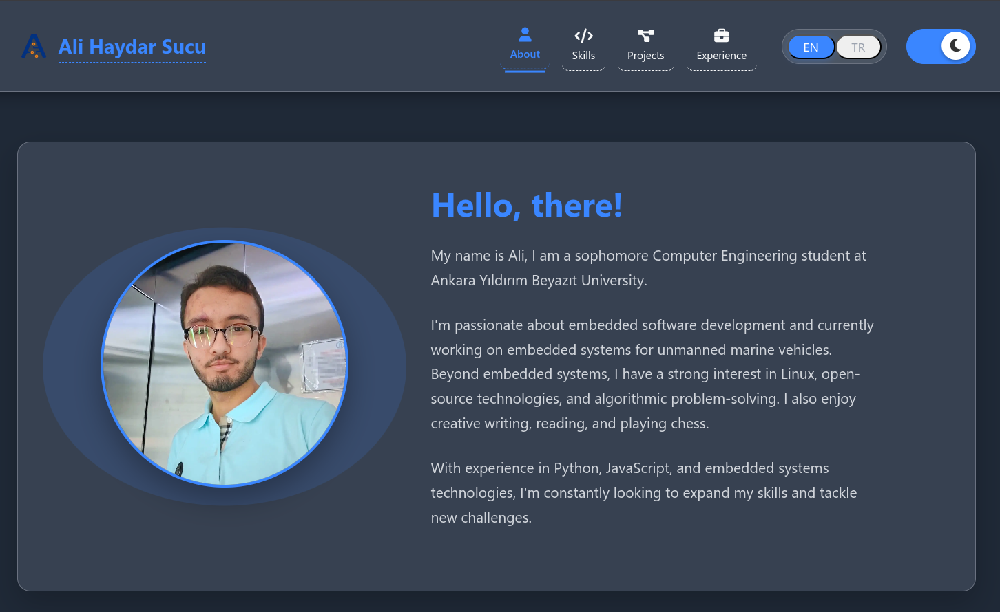
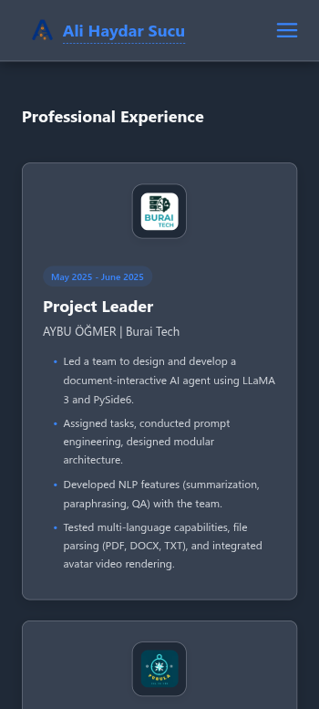
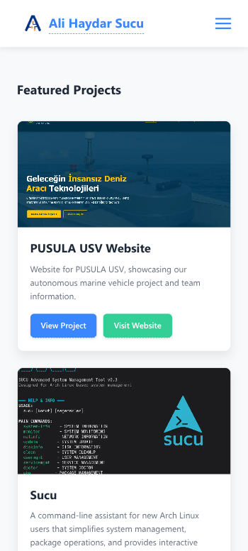
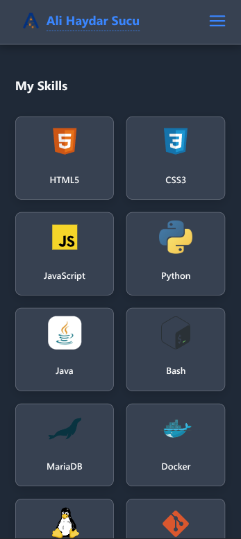

<div align="center">
   
   <h1>Ali Haydar Sucu</h1>
   <p>Computer Engineering Student | Embedded & AI Enthusiast</p>
</div>

- [Project Overview](#project-overview)
- [Features](#features)
- [Blog System](#blog-system)
- [CV Generation](#cv-generation)
- [Tech & Structure](#tech--structure)
- [Responsive Design](#responsive-design)
- [Getting Started](#getting-started)
- [Contact](#contact)


## Project Overview

This repository contains my personal portfolio and blog website, featuring a fully automated CV generation system and a bilingual, category-based blog. The site is designed for both professional presentation and technical content sharing, with a modern, responsive UI and seamless English/Turkish support.


## Features

- **Bilingual Website**: All content and navigation available in English and Turkish, with instant language switching and clean URLs for both languages.
- **Responsive Design**: Mobile-first, grid-based layouts, hamburger navigation, and adaptive breakpoints (1200px, 1035px, 768px, 470px, 370px).
- **Dark/Light Mode**: Automatic system detection and manual toggle, with persistent user preference.
- **Modern UI/UX**: Accessible, semantic HTML, ARIA labels, and visually appealing design.
- **Automated CV Generation**: LaTeX-based, ATS-optimized, Oxford-style CV, auto-built and versioned via GitHub Actions.
- **Dynamic Blog System**: Blog posts are fetched from Substack RSS, parsed, and published with category, subcategory, and language metadata.
- **Clean URL Routing**: Blog posts accessible via `/posts/slug` (EN) and `/yazilar/slug` (TR), with .htaccess rewrite support.
- **Social & SEO**: Open Graph, Twitter Card, and SEO meta tags; social links including Chess.com, LinkedIn, GitHub.

---

## Blog System

- **Content Source**: Blog posts are written on Substack and fetched automatically via RSS.
- **Automated Pipeline**: A GitHub Actions workflow (`update-blog.yml`) fetches the RSS feed hourly, parses posts, and updates `blog-posts.json` only if there are changes (cost-optimized).
- **Metadata Extraction**: Categories, subcategories, and language are extracted from both hashtags and explicit prefixes (e.g., `category:technical`, `lang:tr`).
- **Category System**:
  - Main: Technical, History, Fiction (TR); only Technical (EN)
  - Subcategories (Technical): Systems, Embedded, AI
- **Tab Navigation**: Blog pages feature a two-level tab system for category and subcategory filtering, with language-specific tab logic.
- **Multilingual UI**: All blog UI elements, empty states, and buttons are translated.
- **Share & Copy**: Blog posts have a share button that copies the clean site URL (not Substack) to clipboard.
- **RSS/JSON Structure**: `blog-posts.json` contains all post metadata, used for filtering and display.

---

## CV Generation

- **LaTeX Engine**: CV is written in LaTeX (`cv/cv.tex`) and built with LuaLaTeX.
- **Automation**: GitHub Actions workflow auto-builds and versions the CV on every commit to `cv/`.
- **ATS-Optimized**: Layout and content are designed for applicant tracking systems.
- **Downloadable**: Latest CV is always available for download on the site.

---


## Tech & Structure

<details>
<summary>🛠️ Technology Stack & 📁 Project Structure (click to expand)</summary>
<br>
<div align="center">
   
</div>

<br>

**Frontend:** HTML5, CSS3 (Flexbox/Grid), JavaScript (ES6+), Font Awesome 6<br>
**Automation:** GitHub Actions (blog & CV workflows)<br>
**Other:** LaTeX (LuaLaTeX), Substack RSS, .htaccess for clean URLs<br>
**No backend:** All dynamic content is client-side or via GitHub Actions

```text
.
├── .github/workflows/         # Blog & CV automation
│   ├── update-blog.yml        # Blog RSS/JSON
│   └── generate-cv.yml        # CV generation
├── Assets/                    # Generated CV PDFs
├── cv/                        # CV source files (LaTeX)
├── Images/                    # Icons, screenshots, etc.
├── *.html                     # Website pages (EN & TR)
├── style.css                  # Main stylesheet
├── script.js                  # Main JavaScript (UI, blog, language, etc.)
├── blog-posts.json            # Blog post data (auto-generated)
├── blog-rss.xml               # Latest RSS feed (auto-fetched)
└── convert-rss.js             # RSS→JSON converter (for local/test)
```
</details>

<details>
<summary>🖼️ Visual Showcase (click to expand)</summary>

<div align="center">
   <h3>Desktop View (Dark Mode)</h3>
   
   <p>Homepage on Desktop</p>
   <h3>Mobile Views</h3>
   <table>
      <tr>
         <td align="center">
            
            <p>Experience (Dark Mode)</p>
         </td>
         <td align="center">
            
            <p>Projects (Light Mode)</p>
         </td>
         <td align="center">
            
            <p>Skills (Dark Mode)</p>
         </td>
      </tr>
   </table>
</div>
</details>

## Responsive Design

- **Grid Layouts**: Home and blog pages use adaptive grid layouts (3-col, 2-col, 1-col) based on breakpoints.
- **Hamburger Menu**: Navigation switches to mobile menu below 1035px, with logo left and hamburger right.
- **Tab System**: Blog uses two-level tabs for category/subcategory filtering, with language-specific logic.
- **Mobile Optimizations**: Touch targets, font scaling, and single-column layouts for small screens.

---

## Getting Started

### Prerequisites

- Modern web browser
- GitHub account (for development)
- Node.js (for local blog RSS parsing)
- LaTeX distribution (for local CV generation)

### Local Development

1. Clone the repository:
   ```bash
   git clone https://github.com/alihaydarsucu/alihaydarsucu.github.io.git
   ```
2. Open `index.html` in your browser

### Local Blog Data Update (Optional)

To fetch and parse your Substack blog posts locally:

```bash
curl -s "https://alihaydarsucu.substack.com/feed" > blog-rss.xml
npm install xml2js
node convert-rss.js
```

### Building the CV Locally

1. Install a full LaTeX distribution (e.g., TeX Live)
2. Navigate to the `cv` directory
3. Run:
   ```bash
   lualatex cv.tex
   ```
4. The compiled PDF will be available as `cv.pdf` in the `cv` directory

---

## Contact

- GitHub: [@alihaydarsucu](https://github.com/alihaydarsucu)
- Email: [alihaydarsucu@gmail.com](mailto:alihaydarsucu@gmail.com)
- LinkedIn: [ali-haydar-sucu](https://linkedin.com/in/ali-haydar-sucu)
- Website: [alihaydarsucu.github.io](https://alihaydarsucu.github.io)

---

<div align="center">
  Made with ❤️ by Ali Haydar Sucu
</div>


